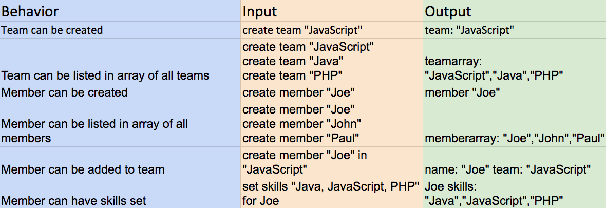

# _Hackathon_

#### _Hackathon, 03-24-2017_

#### By _**Dallas Slaughter**_

## Description
_This is a site for a fictional hackathon. It provides basic information about the hackathon, and a way for event coordinators to create teams and assign members to them. It also allows coordinators to set certain skills for members for ease of assignment._

## Specifications

## Setup/Installation Requirements

* _Clone the repository_
* _Run the command 'gradle run'_
* _Open browser and go to localhost:4567_
* _Or, simply view at https://damp-scrubland-68080.herokuapp.com/_

### License

Copyright (c) 2017 **_Dallas Slaughter_**

This software is licensed under the MIT license.
